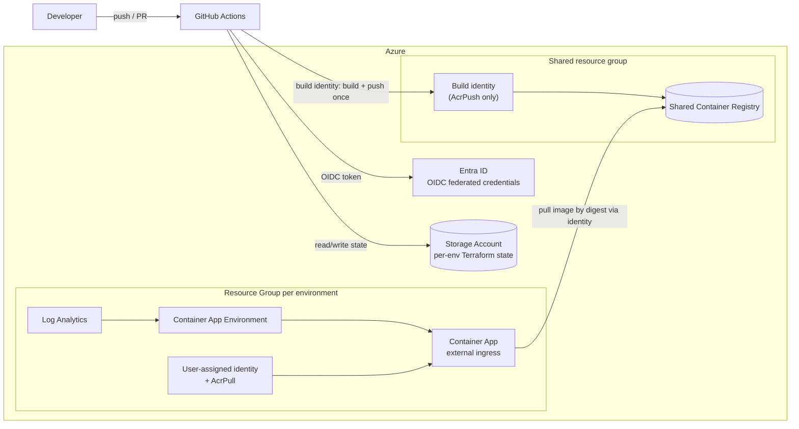

# Azure Container Apps — CI/CD with Terraform & GitHub Actions

A production-style, multi-environment CI/CD pipeline that provisions Azure
infrastructure with **Terraform** and ships a containerized application to
**Azure Container Apps** using **GitHub Actions**. Authentication to Azure is
fully **secretless** via OIDC (Entra ID workload identity federation) — there are
no client secrets or publish profiles stored anywhere.

> **Why this exists:** to spin up a CD pipeline for a Container App *fast*, without
> the slow manual setup. One `bootstrap` run does the tedious one-time wiring for you
> — managed identities, OIDC federation, remote-state backend, role assignments, and
> the GitHub Environments with their scoped variables and secrets — so you can use
> this as a template and have a
> new container app deploying through GitHub Actions in minutes instead of clicking
> through the Azure portal. It still follows the patterns a real team would use:
> infrastructure as code, per-environment isolation, secretless auth, a PR plan gate,
> and build-once/promote-by-digest.

---

## TL;DR — quickstart

New here? Four steps from zero to a deployed app (~15–20 min, mostly waiting on Azure):

```bash
# 0. Prereqs: az CLI (logged in) + gh CLI (authenticated). Terraform optional (CI installs it).
# 1. Use this template (button above) or clone, then:
cp bootstrap/.env.template bootstrap/.env   # fill in your names — see table below
./bootstrap/bootstrap.sh                    # one-time: backend, identities, OIDC, GitHub envs
# 2. Run the `infra-platform` workflow → action=apply, environment=dev
# 3. Push any change under app/** to main → `build-deploy` builds the image ONCE
#    and ships it to dev. Promote that same image to test/prod with `promote`.
```
**Cost.** Container Apps scale to zero, so the shared registry is the only real
standing cost. It defaults to **Standard**: if you created your Azure account within
the last ~12 months, the free-account allowance likely covers **one Standard
registry free for the first year**. If you don't have that allowance, switch the SKU
to `Basic` (~$5/mo) in `bootstrap.sh` — the cheapest steady-state option. (Standard
runs ~$20/mo once the free year ends.)

Stuck on login? See [Troubleshooting](#troubleshooting). Full walkthrough in
[Getting started](#getting-started).

---

## Architecture



Each environment (**dev / test / prod**) has its own resource group, Container App
Environment, managed identity, OIDC credential, and Terraform state key. They share
**one** Container Registry: the image is built **once**, pushed there, and every
environment pulls that same image **by digest** — so what runs in prod is the exact
artifact tested in dev.

---

## Repository layout

```text
infra/
  platform/        Per-env, slow-changing infra: Container App Environment and Log
                   Analytics. Reads (by name) the runtime identity bootstrap
                   created for the Container App to pull with.
  app/             The Container App resource: ingress, scaling, identity and
                   registry bindings. Image = <shared-acr>/<project>@<image_digest>.
app/               Application source. Minimal Python service on :8080 with a
                   /healthz endpoint (placeholder for a real service).
bootstrap/         One-time setup script: backend storage, the shared registry +
                   build identity, a custom provider-registration role, per-env
                   deploy + runtime identities, OIDC federated credentials, role
                   assignments, and the GitHub Environments + variables/secrets.
.github/workflows/
  app-ci.yml           PR gate: builds the app image (no push) — pure Docker, no secrets.
  terraform-plan.yml   PR gate: fmt-check, validate, and plan both stacks.
  build-deploy.yml     On merge to main: build image ONCE -> push to shared ACR -> deploy dev by digest.
  promote.yml          Manual: promote an already-built digest to test/prod (no rebuild).
  infra-platform.yml   Manual plan/apply/destroy of the platform stack.
  infra-app.yml        Manual plan/destroy of the app stack (no apply).
```

> `infra-app` has no `apply` on purpose (see [Single applier](#cicd-flow));
> `build-deploy` applies dev, `promote` applies test/prod.

---

## How authentication works (secretless)

`bootstrap.sh` creates, **per environment**, a user-assigned managed identity with
a **federated credential** whose subject is
`repo:<owner>/<repo>:environment:<env>`. The GitHub workflows request an OIDC
token and exchange it for Azure access — so Azure trusts a specific repo +
environment directly. No secrets are stored; the only GitHub *secret* is the
subscription ID (not sensitive on its own).

**Separation of duties (least privilege):**

- A dedicated **build identity** (subject `…:environment:build`) holds **only
  `AcrPush`** on the shared registry. It can build and push images — and nothing
  else.
- The **dev / test / prod** deploy identities can deploy to their own resource
  group and **pull** (`AcrPull`) from the shared registry, but **cannot push**
  images.

The running Container App pulls images from the shared registry using a separate
**user-assigned identity + AcrPull role** — not registry admin credentials.

---

## CI/CD flow

| Workflow | Trigger | Does | Applies? |
|---|---|---|---|
| `app-ci` | pull request | build app image (no push) — fails the PR on a broken build | no |
| `terraform-plan` | pull request on `infra/**` | fmt-check, validate, plan both stacks | no |
| `build-deploy` | push to `main` | build image **once** → push to shared ACR → apply **dev** by digest | **yes (dev)** |
| `promote` | manual (test/prod) | resolve a commit's digest → apply that env by digest (**no rebuild**) | **yes (test/prod)** |
| `infra-platform` | manual | plan / apply / destroy per-env platform infra | yes (manual) |
| `infra-app` | manual | plan / destroy app infra | **no** |

**Build once, promote the same artifact.** `build-deploy` builds the image a single
time on merge and captures its **digest** (`sha256:…`). dev deploys that digest
immediately; `promote` later deploys the *same* digest to test/prod without
rebuilding. So the exact bytes tested in dev are what run in prod — no "rebuilt from
source and hopefully identical."

**Single applier of app state.** `infra-app` deliberately cannot `apply`. Only
`build-deploy` (dev) and `promote` (test/prod) apply the app stack, each supplying a
real digest — so two pipelines never fight over the same state.

**Prod gate (opt-in).** If you set `PROD_REVIEWERS` in `.env` (or add required
reviewers to the `prod` GitHub Environment in the UI), a `promote` to production
pauses for manual approval before Azure login or apply. If you don't, prod
promotions run without a gate.

---

## Getting started

### Prerequisites

- An Azure subscription and the `az` CLI (logged in)
- The GitHub CLI (`gh`, authenticated)
- A GitHub repo — the bootstrap script creates the `build` / `dev` / `test` /
  `prod` **Environments** and their scoped variables/secrets for you
- *(optional)* Terraform — only if you want to edit/format the `.tf` files
  locally; the workflows install Terraform themselves in CI, and `bootstrap.sh` doesn't
  use it

### 1. Bootstrap (once)

```bash
cp bootstrap/.env.template bootstrap/.env   # then fill in the values below
./bootstrap/bootstrap.sh
```

`.env` values the script needs (subscription and tenant are read automatically
from your logged-in `az` session, so they aren't listed here):

| Variable | Purpose |
|---|---|
| `RESOURCE_GROUP_BASE_NAME` | Base for all RGs (`<base>-dev/test/prod`, `<base>-tfstatestorage`) |
| `LOCATION` | Azure region (e.g. `westeurope`) |
| `STORAGE_ACCOUNT_NAME` | Remote-state storage account (globally unique, 3–24 lowercase alphanumeric) |
| `BLOB_CONTAINER_NAME` | Base name of the per-env state container (`<name>-dev`, …) |
| `MANAGED_IDENTITY_NAME` | Base name of the per-env managed identity |
| `FEDERATED_CREDENTIAL_NAME` | Base name of the per-env OIDC federated credential |
| `GITHUB_OWNER` / `GITHUB_REPO` | The repo the OIDC credentials and env vars target |
| `PROD_REVIEWERS` | *(optional)* comma-separated GitHub usernames who must approve prod promotions |

The script creates the Terraform backend storage, the **shared registry +
build identity**, and a **custom subscription-scoped role** (`Resource Provider
Registrant`) that lets each environment's identity register resource providers
without any broader access (see [Design decisions](#design-decisions--trade-offs)).
Then, for each environment: a resource group, a deploy identity (OIDC) and a
runtime identity (with `AcrPull` on the shared registry), a state container, role
assignments, the GitHub **Environment**, and its scoped variables/secrets.

### 2. Provision the platform

Run **`infra-platform`** → `apply`, environment `dev`. Creates the Container App
Environment and Log Analytics. (The shared registry and the runtime identity were
already created by bootstrap.)

### 3. Build and deploy the app

Push a change under `app/**` to `main`. **`build-deploy`** builds the image once,
pushes it to the shared registry, and deploys **dev** pinned to its digest.

### Promoting to test / production

Run **`promote`** manually with the target `environment` and the `commit_sha` you
want to ship (after `infra-platform` apply for that env). It resolves that commit's
digest from the shared registry and deploys the **same image** — no rebuild. Set
`PROD_REVIEWERS` in `.env` (or configure required reviewers on the `prod`
Environment) so production promotions require an approval click.

---

## Configuration

Workflows read these from GitHub variables/secrets (set by bootstrap). Most are
**environment-scoped** (per `build` / `dev` / `test` / `prod`); the shared-registry
locators are **repo-level**:

| Name | Scope | Kind | Purpose |
|---|---|---|---|
| `AZURE_CLIENT_ID` | env | var | Identity client ID for OIDC (build identity for `build`, deploy identity for the rest) |
| `AZURE_TENANT_ID` | env | var | Entra tenant |
| `AZURE_SUBSCRIPTION_ID` | env | secret | Target subscription |
| `RESOURCE_GROUP_NAME` | env | var | Per-env resource group |
| `TF_BACKEND_CONTAINER` | env | var | Per-env Terraform state container |
| `TF_BACKEND_RESOURCE_GROUP` / `_STORAGE_ACCOUNT` | repo | var | Remote state backend |
| `SHARED_ACR_NAME` / `SHARED_RESOURCE_GROUP` | repo | var | Locate the shared registry (build/promote + platform stack) |

Per-environment Terraform inputs live in `infra/<stack>/env/<env>.tfvars`.

---

## Troubleshooting

Most failures are OIDC/bootstrap related and have cryptic Azure error codes. The
common ones:

| Symptom | Likely cause | Fix |
|---|---|---|
| `AADSTS70021: No matching federated identity record found` | You forked, or bootstrap was run against a different repo. Credentials are scoped to `repo:<owner>/<repo>:environment:<env>`. | Re-run `bootstrap.sh` with the correct `GITHUB_OWNER`/`GITHUB_REPO`. |
| `AADSTS700016 / 700213` on Azure login | Workflow's GitHub **Environment** doesn't match a federated credential subject (e.g. running `prod` before bootstrapping it). | Bootstrap that environment, or pick one that exists. |
| `Error: building account: could not configure AzureCli` / `unauthorized` | The job didn't request an OIDC token. | Ensure the job sets `permissions: id-token: write`. |
| `terraform init` backend errors | Backend storage/container missing or wrong `*_BACKEND_*` vars. | Confirm bootstrap created the state account; check the env vars in the GitHub Environment. |
| `docker push` / `az acr login` → `denied` | The build identity lacks `AcrPush`, or `SHARED_ACR_NAME` is wrong/unset. | Re-run `bootstrap.sh`; confirm the repo-level `SHARED_ACR_NAME` / `SHARED_RESOURCE_GROUP` variables. |
| `promote` fails: `No image webapp:<sha>` | That commit was never built on `main` (so no image exists to promote). | Merge it to `main` first (which builds it), then promote that commit SHA. |
| `data.azurerm_container_registry.shared` not found during plan/apply | Shared registry missing or `TF_VAR_tf_shared_*` not passed. | Confirm bootstrap created the shared ACR; check `SHARED_ACR_NAME` / `SHARED_RESOURCE_GROUP`. |

---

## Design decisions & trade-offs

- **Build once, promote by digest.** The image is built a single time and promoted
  by immutable digest across environments, so prod runs the exact artifact tested in
  dev. The trade-off: all environments share one registry, so blast-radius isolation
  is weaker than a registry-per-environment (an acceptable cost for cheap + simple).
- **Dedicated build identity.** Pushing images and deploying are separated: the
  build identity can only push, the deploy identities can only pull + deploy.
- **Subscription-scoped role for provider registration.** Terraform must register
  resource providers, which isn't possible at resource-group scope — hence a
  broader role assignment.
- **Scale-to-zero (`min_replicas = 0`)** keeps idle compute cost at zero; the main
  standing cost is the **one shared** registry. Its `--sku` in `bootstrap.sh`
  defaults to `Standard` (free for a year on a recent Azure account); drop it to
  `Basic` (~$5/mo) for the cheapest steady state, or `Premium` for more
  storage/throughput or private endpoints. See [Cost](#tldr--quickstart).
- **Platform/app split** isolates rarely-changing platform infra from frequent app
  deploys, and keeps blast radius small.

---

## Reuse this pipeline

This repo is a **GitHub template** — click **"Use this template" → Create a new
repository** to get your own independent repo (your name, fresh history, no fork
relationship). Then follow [Getting started](#getting-started) with **your**
`GITHUB_OWNER` / `GITHUB_REPO` and Azure names in `bootstrap/.env`.

> **Don't just fork it.** A fork shows a "forked from" banner and, more importantly,
> the OIDC federated credentials are scoped to a specific repo
> (`repo:<owner>/<repo>:environment:<env>`). They are **repo-specific**, so any reuse
> must re-run bootstrap against the new repo — otherwise Azure rejects the login.

Prefer the command line? Clone, detach history, and push to a fresh repo:

```bash
git clone <this-repo-url> my-pipeline && cd my-pipeline
rm -rf .git && git init && git add -A && git commit -m "Initial commit"
gh repo create my-pipeline --private --source=. --push
```
